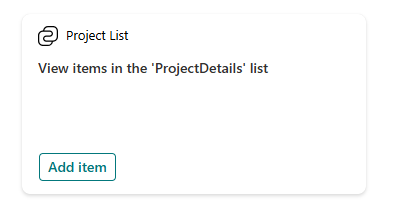
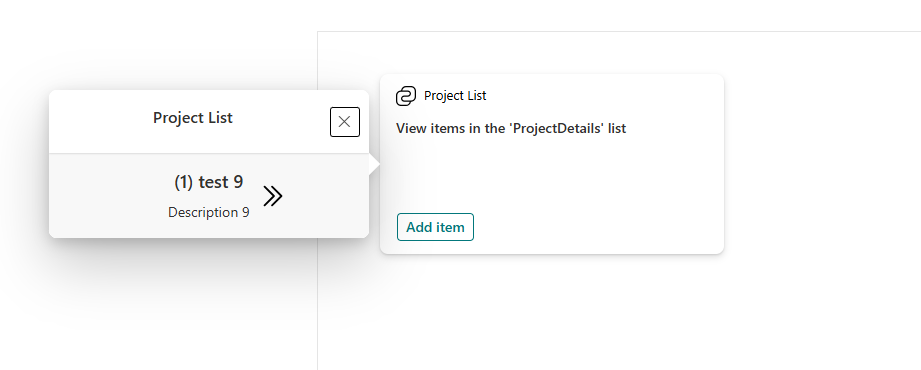
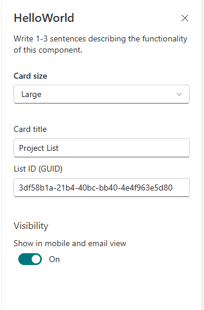
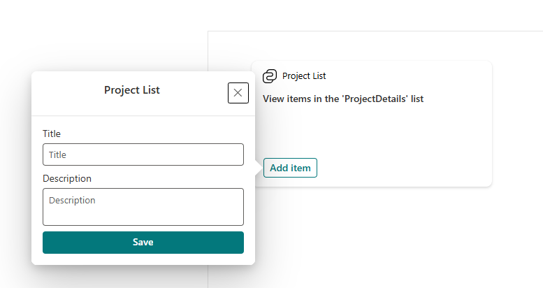

# SPFx Adaptive Card Extension: Dynamic SharePoint List Viewer & Adder

An **Adaptive Card Extension (ACE)** for SharePoint that allows users to:
- Display a **left icon** and **title** in the same row.
- Show a **View Items in <Dynamic List Name>** button.
- Add new items to a SharePoint list via an **Add Item** button.

---

## ✨ Features

- **Dynamic List Integration**:
  - Configure **SharePoint List ID** in the Property Pane.
  - The list must have **Title** and **Description** columns.
- **Card Size Options**:
  - Large or Medium (configurable).
- **View Items**:
  - Opens a dialog showing all list items (Title & Description).
  - Navigate items using **Next** and **Previous** icons.
- **Add Item**:
  - Opens a form to add new Title and Description to the list.

---
---

## 🖼️ Screenshots

### Card View


### Quick View Dialog


### Properties Panel


### Add Item Dialog


---

## 4BB Tech Stack

- **SharePoint Framework (SPFx)**: `1.21.1`
- **Adaptive Card Extensions Base**: `@microsoft/sp-adaptive-card-extension-base`
- **TypeScript**: `~5.3.3`
- **Gulp**: `4.0.2`

### Dependencies
```json
"dependencies": {
  "tslib": "2.3.1",
  "@microsoft/sp-core-library": "1.21.1",
  "@microsoft/sp-property-pane": "1.21.1",
  "@microsoft/sp-adaptive-card-extension-base": "1.21.1"
}
```

### Dev Dependencies
```json
"devDependencies": {
  "@microsoft/rush-stack-compiler-5.3": "0.1.0",
  "@rushstack/eslint-config": "4.0.1",
  "@microsoft/eslint-plugin-spfx": "1.21.1",
  "@microsoft/eslint-config-spfx": "1.21.1",
  "@microsoft/sp-build-web": "1.21.1",
  "@types/webpack-env": "~1.15.2",
  "ajv": "^6.12.5",
  "eslint": "8.57.1",
  "gulp": "4.0.2",
  "typescript": "~5.3.3",
  "@microsoft/sp-module-interfaces": "1.21.1"
}
```

---

## ✅ Prerequisites

- Node.js (Recommended: **18.x LTS**)
- Gulp CLI
- Office 365 tenant with App Catalog

---

## 680 Getting Started

```bash
npm install
gulp trust-dev-cert
gulp serve
```

Open local or SharePoint workbench to test.

---

## ⚙️ Property Pane Configuration

- **Card Properties**:
  - Title
  - Icon
  - Size (Large, Medium)
  - SharePoint List ID

Example JSON:
```json
{
  "title": "Project Tasks",
  "icon": "TaskLogo",
  "size": "Large",
  "listId": "<GUID-of-your-list>"
}
```


##7️ Build & Deploy

```bash
gulp bundle --ship
gulp package-solution --ship
```

Upload `.sppkg` to App Catalog and deploy.

---

## License

MIT License
